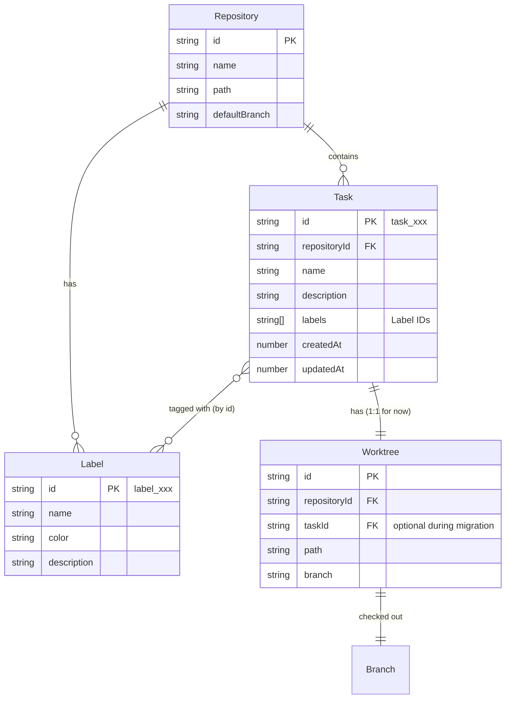

# Task-Worktree Data Model Implementation

## Overview

Redesign Homer's core data model with **Task** as the primary dimension, replacing the current Worktree-centric approach. Users work on Tasks, which map 1:1 to Worktrees (with future 1:N support designed in).

**Core relationship:**

```
Repository 1:N Task 1:1 Worktree 1:1 Branch
```

> **Note:** Schema supports 1:N Task:Worktree but UI is 1:1 only. Do not implement 1:N until concrete use case exists.

## Problem Statement

- Worktrees are created with random branch names (city names like `tokyo`)
- Users rename branches to meaningful names after starting work
- Current UI displays Worktrees directly, lacking task semantics
- Users think in terms of "tasks" not "worktrees" - mental model mismatch

## Proposed Solution

Introduce a Task entity as the primary UI dimension:

- Tasks have user-defined names and flexible label-based status
- Each Task links to a Worktree (1:1 for now, 1:N ready)
- Sidebar shows Tasks grouped by Repository
- Labels replace status field for workflow flexibility

## Technical Approach

### Phase 1: Data Model & Types

**Files to modify/create:**

1. `apps/desktop/src/shared/types.ts` - Add schemas

```typescript
// Label schema - uses id as primary key (enables renaming)
export const LabelSchema = z.object({
  id: z.string(), // label_${nanoid(8)} - PRIMARY KEY
  name: z.string().min(1).max(50), // Display name, can be renamed
  color: z.string().regex(/^[0-9A-Fa-f]{6}$/), // hex without #
  description: z.string().max(200).optional(),
});
export type Label = z.infer<typeof LabelSchema>;

// ID generation for labels
export const generateLabelId = () => `label_${nanoid(8)}`;

// Default labels constant - FIXED: unique colors for each
export const DEFAULT_LABELS: Label[] = [
  { id: "label_todo", name: "todo", color: "e4e669", description: "Not started" },
  { id: "label_progress", name: "in-progress", color: "0075ca", description: "In progress" },
  { id: "label_review", name: "review", color: "a2eeef", description: "Pending review" },
  { id: "label_done", name: "done", color: "0e8a16", description: "Completed" },
  { id: "label_cancelled", name: "cancelled", color: "6e7681", description: "Cancelled" },
  { id: "label_bug", name: "bug", color: "d73a4a", description: "Bug fix" },
  { id: "label_feature", name: "feature", color: "7057ff", description: "New feature" }, // FIXED: was duplicate
  { id: "label_refactor", name: "refactor", color: "d4c5f9", description: "Refactoring" },
] as const satisfies readonly Label[];

// Git branch name validation
export const GitBranchNameSchema = z
  .string()
  .min(1)
  .max(244)
  .regex(
    /^[a-zA-Z0-9][a-zA-Z0-9._/-]*$/,
    "Branch name must start with alphanumeric and contain only letters, numbers, dots, underscores, slashes, and hyphens",
  );

// Task schema
export const TaskSchema = z.object({
  id: z.string(),
  repositoryId: z.string(),
  name: z.string().min(1).max(100),
  description: z.string().max(2000).optional(),
  labels: z.array(z.string()), // References Label.id (not name)
  createdAt: z.number(), // Unix timestamp ms
  updatedAt: z.number(),
});
export type Task = z.infer<typeof TaskSchema>;

// Modify RepositorySchema - add labels field
export const RepositorySchema = z.object({
  id: z.string(),
  name: z.string(),
  path: z.string(),
  defaultBranch: z.string(),
  labels: z.array(LabelSchema).default([]), // NEW
});

// Modify StoredWorktreeSchema - add taskId field
export const StoredWorktreeSchema = z.object({
  id: z.string(),
  repositoryId: z.string(),
  taskId: z.string().optional(), // NEW - optional for migration
  path: z.string(),
  branch: z.string(),
});

// Update StoreSchema - now a Zod schema (enables runtime validation)
export const StoreSchemaZod = z.object({
  version: z.number().default(1), // NEW: schema version for migrations
  repositories: z.array(RepositorySchema),
  tasks: z.array(TaskSchema), // NEW
  worktrees: z.array(StoredWorktreeSchema),
});
export type StoreSchema = z.infer<typeof StoreSchemaZod>;
```

**ID Generation:**

```typescript
// Use nanoid for IDs
import { nanoid } from "nanoid";
export const generateTaskId = () => `task_${nanoid(12)}`;
export const generateLabelId = () => `label_${nanoid(8)}`;
```

### Phase 2: Store Service Layer

**Files to modify:**

1. `apps/desktop/src/main/services/store-service.ts` - Add Task CRUD

```typescript
// New methods to add:

// Task operations
getTasks(): Task[]
getTasksByRepository(repositoryId: string): Task[]
getTask(id: string): Task | undefined
addTask(task: Task): void
updateTask(id: string, updates: Partial<Omit<Task, 'id' | 'repositoryId' | 'createdAt'>>): void
removeTask(id: string): void

// Worktree operations - ADD THIS METHOD (currently missing)
updateWorktree(id: string, updates: Partial<Omit<StoredWorktree, 'id'>>): void

// Label operations (on Repository)
getLabels(repositoryId: string): Label[]
addLabel(repositoryId: string, label: Label): void  // Throws if label.id already exists
updateLabel(repositoryId: string, labelId: string, updates: Partial<Omit<Label, 'id'>>): void
removeLabel(repositoryId: string, labelId: string, options?: { force?: boolean }): void
// If force=false and label is in use, throws error
// If force=true, removes label from all tasks that reference it

// Modified repository methods
addRepository(repository: Repository): void  // Now includes default labels
```

2. `apps/desktop/src/main/services/task-service.ts` - New service

```typescript
export class TaskService {
  constructor(
    private store: StoreService,
    private worktree: WorktreeService,
  ) {}

  /**
   * Create task with worktree atomically.
   * Order: Create worktree first (more likely to fail), then persist task.
   * Rollback: If task persistence fails, remove the created worktree.
   */
  async createTask(input: {
    repositoryId: string;
    name: string;
    description?: string;
    labels?: string[]; // References Label.id
    branchName?: string; // Optional override, validated with GitBranchNameSchema
  }): Promise<{ task: Task; worktree: Worktree }> {
    // 1. Create worktree first (most likely to fail - git operations)
    const worktree = await this.worktree.create({
      repositoryId: input.repositoryId,
      branch: input.branchName ?? generateRandomBranchName(),
      isNewBranch: true,
    });

    try {
      // 2. Create and persist task
      const task: Task = {
        id: generateTaskId(),
        repositoryId: input.repositoryId,
        name: input.name,
        description: input.description,
        labels: input.labels ?? [],
        createdAt: Date.now(),
        updatedAt: Date.now(),
      };
      this.store.addTask(task);

      // 3. Link worktree to task
      this.store.updateWorktree(worktree.id, { taskId: task.id });

      return { task, worktree };
    } catch (error) {
      // Rollback: remove the created worktree
      await this.worktree.remove(worktree.id, { force: true });
      throw error;
    }
  }

  // Delete task and optionally its worktree
  async deleteTask(taskId: string, deleteWorktree?: boolean): Promise<void>;

  // Get task with its worktree(s)
  getTaskWithWorktrees(taskId: string): { task: Task; worktrees: Worktree[] } | undefined;
}
```

### Phase 3: Contract & Router Updates

**Files to modify/create:**

1. `apps/desktop/src/shared/contract/task.ts` - New contract

```typescript
import { oc } from "@orpc/contract";
import { z } from "zod";
import { TaskSchema, WorktreeSchema, GitBranchNameSchema } from "../types";

export const taskContract = {
  // List tasks for a repository
  list: oc.input(z.object({ repositoryId: z.string() })).output(z.array(TaskSchema)),

  // Get single task with worktrees
  get: oc.input(z.object({ taskId: z.string() })).output(
    z.object({
      task: TaskSchema,
      worktrees: z.array(WorktreeSchema),
    }),
  ),

  // Create task (also creates worktree)
  create: oc
    .input(
      z.object({
        repositoryId: z.string(),
        name: z.string().min(1).max(100),
        description: z.string().max(2000).optional(),
        labels: z.array(z.string()).optional(), // Label IDs
        branchName: GitBranchNameSchema.optional(), // Validated branch name
      }),
    )
    .output(
      z.object({
        task: TaskSchema,
        worktree: WorktreeSchema,
      }),
    ),

  // Update task metadata
  update: oc
    .input(
      z.object({
        taskId: z.string(),
        name: z.string().min(1).max(100).optional(),
        description: z.string().max(2000).optional(),
        labels: z.array(z.string()).optional(),
      }),
    )
    .output(TaskSchema),

  // Delete task - FIXED: explicit output type
  delete: oc
    .input(
      z.object({
        taskId: z.string(),
        deleteWorktree: z.boolean().default(true),
      }),
    )
    .output(z.void()),
};
```

2. `apps/desktop/src/shared/contract/label.ts` - New contract

```typescript
import { oc } from "@orpc/contract";
import { z } from "zod";
import { LabelSchema } from "../types";

export const labelContract = {
  // List labels for repository
  list: oc.input(z.object({ repositoryId: z.string() })).output(z.array(LabelSchema)),

  // Create label - name uniqueness validated in handler
  create: oc
    .input(
      z.object({
        repositoryId: z.string(),
        name: z.string().min(1).max(50),
        color: z.string().regex(/^[0-9A-Fa-f]{6}$/),
        description: z.string().max(200).optional(),
      }),
    )
    .output(LabelSchema),

  // Update label - uses labelId, name is now editable
  update: oc
    .input(
      z.object({
        repositoryId: z.string(),
        labelId: z.string(), // Changed from name to labelId
        name: z.string().min(1).max(50).optional(), // Name is now editable
        color: z
          .string()
          .regex(/^[0-9A-Fa-f]{6}$/)
          .optional(),
        description: z.string().max(200).optional(),
      }),
    )
    .output(LabelSchema),

  // Delete label - FIXED: explicit output, cascade behavior
  delete: oc
    .input(
      z.object({
        repositoryId: z.string(),
        labelId: z.string(), // Changed from name to labelId
        force: z.boolean().default(false), // If true, remove from all tasks
      }),
    )
    .output(
      z.object({
        deletedFromTasks: z.number(), // How many tasks were updated
      }),
    ),
};
```

3. `apps/desktop/src/shared/contract/index.ts` - Export new contracts

4. `apps/desktop/src/main/ipc/router/task.ts` - New router
5. `apps/desktop/src/main/ipc/router/label.ts` - New router
6. `apps/desktop/src/main/ipc/router/index.ts` - Add to main router

### Phase 4: Migration Logic

**Files to create:**

1. `apps/desktop/src/main/migrations/index.ts` - Versioned migration runner

```typescript
import type { StoreService } from "../services/store-service";
import { DEFAULT_LABELS, generateTaskId, type Task } from "../../shared/types";

interface Migration {
  version: number;
  name: string;
  run: (store: StoreService) => void;
}

const MIGRATIONS: Migration[] = [
  {
    version: 1,
    name: "add-repository-labels",
    run: (store) => {
      // Add default labels to repositories without labels
      const repos = store.getRepositories();
      for (const repo of repos) {
        if (!repo.labels?.length) {
          store.updateRepository(repo.id, { labels: [...DEFAULT_LABELS] });
        }
      }
    },
  },
  {
    version: 2,
    name: "create-tasks-for-orphan-worktrees",
    run: (store) => {
      // Create tasks for worktrees without taskId
      const worktrees = store.getWorktrees();
      for (const wt of worktrees) {
        if (!wt.taskId) {
          const task: Task = {
            id: generateTaskId(),
            repositoryId: wt.repositoryId,
            name: wt.branch, // Use branch as task name
            labels: [],
            createdAt: Date.now(),
            updatedAt: Date.now(),
          };
          store.addTask(task);
          store.updateWorktree(wt.id, { taskId: task.id });
        }
      }
    },
  },
];

/**
 * Run pending migrations on app startup.
 * Tracks version in store to prevent re-running completed migrations.
 */
export function runMigrations(store: StoreService): void {
  const currentVersion = store.getSchemaVersion(); // Returns 0 if not set

  for (const migration of MIGRATIONS) {
    if (migration.version > currentVersion) {
      console.log(`Running migration v${migration.version}: ${migration.name}`);
      migration.run(store);
      store.setSchemaVersion(migration.version);
    }
  }
}
```

2. `apps/desktop/src/main/services/store-service.ts` - Add version methods

```typescript
// Add to StoreService class:
getSchemaVersion(): number {
  return this.store.get('version', 0);
}

setSchemaVersion(version: number): void {
  this.store.set('version', version);
}
```

3. `apps/desktop/src/main/app.ts` - Add migration call

```typescript
import { runMigrations } from "./migrations";

// In App constructor or init method
runMigrations(this.store);
```

### Phase 5: Zustand Store Updates

**Files to modify:**

1. `apps/desktop/src/renderer/src/stores/slices/task-slice.ts` - New slice

```typescript
import type { StateCreator } from "zustand/vanilla";

export interface TaskSlice {
  // State
  selectedTaskId: string | null;
  expandedRepositoryIds: string[];

  // Actions
  selectTask: (id: string | null) => void;
  toggleRepositoryExpanded: (id: string) => void;
}

export const createTaskSlice: StateCreator<TaskSlice, [], [], TaskSlice> = (set) => ({
  selectedTaskId: null,
  expandedRepositoryIds: [],

  selectTask: (id) => set({ selectedTaskId: id }),
  toggleRepositoryExpanded: (id) =>
    set((state) => ({
      expandedRepositoryIds: state.expandedRepositoryIds.includes(id)
        ? state.expandedRepositoryIds.filter((x) => x !== id)
        : [...state.expandedRepositoryIds, id],
    })),
});
```

> **Note:** `selectedTaskId` replaces `WorkspaceSlice.selectedWorktreeId`. When a Task is selected, its Worktree is implicitly selected. Remove `selectedWorktreeId` from `WorkspaceSlice` after migration.

2. `apps/desktop/src/renderer/src/stores/slices/index.ts` - Export new slice

3. `apps/desktop/src/renderer/src/stores/app-store.ts` - Compose with new slice

### Phase 6: Sidebar UI Updates

**Files to modify:**

1. `apps/desktop/src/renderer/src/components/layout/sidebar.tsx`

**Changes:**

- Replace Worktree list with Task list
- Group Tasks by Repository (accordion)
- Display Task name + label color dots
- Click Task to select and open Worktree
- Add "New Task" button per Repository
- Show empty state when no Tasks

**Task list item component:**

```tsx
function TaskListItem({ task, worktree }: { task: Task; worktree: Worktree }) {
  const labels = useLabels(task.repositoryId);
  // FIXED: filter by label.id, not label.name
  const taskLabels = labels.filter((l) => task.labels.includes(l.id));

  return (
    <button onClick={() => selectTask(task.id)}>
      <span className="truncate">{task.name}</span>
      <div className="flex gap-1">
        {taskLabels.map((label) => (
          <span
            key={label.id}
            className="w-2 h-2 rounded-full"
            style={{ backgroundColor: `#${label.color}` }}
            title={label.name}
          />
        ))}
      </div>
    </button>
  );
}
```

### Phase 7: Task Creation Dialog

**Files to create:**

1. `apps/desktop/src/renderer/src/components/task/create-task-dialog.tsx`

```tsx
interface CreateTaskDialogProps {
  repositoryId: string;
  open: boolean;
  onOpenChange: (open: boolean) => void;
}

function CreateTaskDialog({ repositoryId, open, onOpenChange }: CreateTaskDialogProps) {
  const [name, setName] = useState("");
  const [description, setDescription] = useState("");
  const [selectedLabels, setSelectedLabels] = useState<string[]>([]);
  const [branchName, setBranchName] = useState("");

  const labels = useLabels(repositoryId);
  const createTask = useCreateTask();

  // Generate random branch name on open
  useEffect(() => {
    if (open) {
      setBranchName(generateRandomBranchName());
    }
  }, [open]);

  // FIXED: Add error handling
  const handleSubmit = async () => {
    try {
      await createTask.mutateAsync({
        repositoryId,
        name,
        description: description || undefined,
        labels: selectedLabels, // These are Label IDs
        branchName,
      });
      onOpenChange(false);
    } catch (error) {
      // Show error toast - don't close dialog on failure
      console.error("Failed to create task:", error);
      // TODO: Display error to user via toast or inline message
    }
  };

  return (
    <Dialog open={open} onOpenChange={onOpenChange}>
      <DialogContent>
        <DialogHeader>
          <DialogTitle>New Task</DialogTitle>
        </DialogHeader>

        <div className="space-y-4">
          <Input
            label="Task Name"
            value={name}
            onChange={(e) => setName(e.target.value)}
            required
          />

          <Textarea
            label="Description (optional)"
            value={description}
            onChange={(e) => setDescription(e.target.value)}
          />

          <LabelSelector labels={labels} selected={selectedLabels} onChange={setSelectedLabels} />

          <Input
            label="Branch Name"
            value={branchName}
            onChange={(e) => setBranchName(e.target.value)}
          />
        </div>

        <DialogFooter>
          <Button variant="outline" onClick={() => onOpenChange(false)}>
            Cancel
          </Button>
          <Button onClick={handleSubmit} disabled={!name}>
            Create Task
          </Button>
        </DialogFooter>
      </DialogContent>
    </Dialog>
  );
}
```

### Phase 8: Label Management UI

**Files to create:**

1. `apps/desktop/src/renderer/src/components/label/label-manager-dialog.tsx`

Entry point: Repository context menu → "Manage Labels"

Features:

- List all labels with color preview
- Create new label (name, color picker, description)
- Edit existing label (color, description - name immutable after creation)
- Delete label (with warning if in use)

## Acceptance Criteria

### Functional Requirements

- [ ] Repository stores labels array with 8 default labels on creation
- [ ] Task entity created with id, repositoryId, name, description, labels, timestamps
- [ ] Worktree entity has optional taskId field
- [ ] Creating a Task atomically creates its Worktree
- [ ] If Worktree creation fails, Task is not persisted (rollback)
- [ ] Sidebar displays Tasks grouped by Repository
- [ ] Clicking a Task opens its Worktree
- [ ] Labels displayed as color dots on Task items
- [ ] Task creation dialog with name, description, labels, branch name
- [ ] Label management accessible from Repository context menu

### Non-Functional Requirements

- [ ] Existing worktrees migrated to Tasks on app startup
- [ ] Existing repositories get default labels on startup
- [ ] Migration is idempotent (safe to run multiple times)
- [ ] Task operations respond in <100ms
- [ ] No breaking changes to existing worktree data

### Quality Gates

- [ ] Types compile without errors
- [ ] All new services have corresponding contract definitions
- [ ] Store schema changes are backwards compatible
- [ ] Migration tested with existing data

## ERD Diagram



## Key Decisions

| Decision             | Choice                        | Rationale                                    |
| -------------------- | ----------------------------- | -------------------------------------------- |
| Task ID format       | `task_${nanoid(12)}`          | Unique, short, no path dependency            |
| Label ID format      | `label_${nanoid(8)}`          | Enables renaming without breaking references |
| Label reference      | By ID string                  | Enables label renaming (Kieran review fix)   |
| taskId on Worktree   | Optional field                | Backwards compatible migration               |
| Default labels       | 8 preset labels               | Common workflow states covered               |
| Timestamps           | Unix ms (number)              | Simple, no timezone issues                   |
| Task:Worktree ratio  | 1:1 now, schema ready for 1:N | Do not implement 1:N until needed            |
| Migration versioning | Version number in store       | Prevents re-running completed migrations     |
| Atomic task creation | Worktree first, then task     | Enables rollback on failure                  |

## Review Feedback Applied

| Reviewer   | Issue                           | Resolution                                           |
| ---------- | ------------------------------- | ---------------------------------------------------- |
| Kieran     | Label uses name as PK           | Changed to `id` field with `label_xxx` format        |
| Kieran     | No rollback strategy            | Added try/catch with worktree cleanup in TaskService |
| Kieran     | Missing updateWorktree          | Added to StoreService methods                        |
| Kieran     | Delete missing output           | Added `.output(z.void())` to contracts               |
| Kieran     | Duplicate label colors          | Fixed `feature` color from `a2eeef` to `7057ff`      |
| Kieran     | Migration lacks versioning      | Added version-based migration runner                 |
| Kieran     | Branch name validation          | Added `GitBranchNameSchema` with regex               |
| Kieran     | Create dialog no error handling | Added try/catch in handleSubmit                      |
| DHH        | 1:N is YAGNI                    | Kept schema but added note: UI is 1:1 only           |
| Simplicity | Task description unnecessary    | Kept but marked optional, can remove if unused       |

## References

### Internal References

- Brainstorm: `docs/brainstorms/2026-02-01-task-worktree-model-brainstorm.md`
- Current types: `apps/desktop/src/shared/types.ts:1-89`
- Store service: `apps/desktop/src/main/services/store-service.ts:1-102`
- Workspace slice: `apps/desktop/src/renderer/src/stores/slices/workspace-slice.ts:1-33`
- Workspace contract: `apps/desktop/src/shared/contract/workspace.ts:1-104`
- Worktree service: `apps/desktop/src/main/services/worktree-service.ts:1-428`

### Related Work

- Recent refactor: `3bd446b refactor(desktop): migrate to app store with slices`
