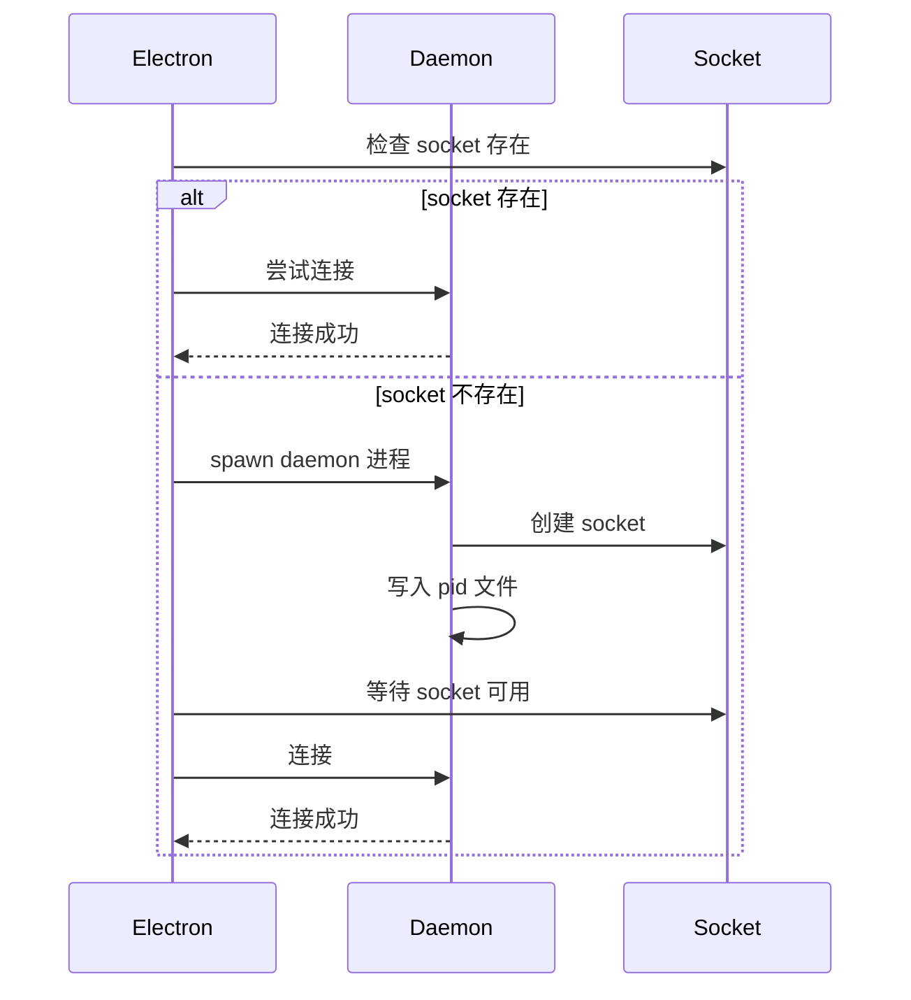
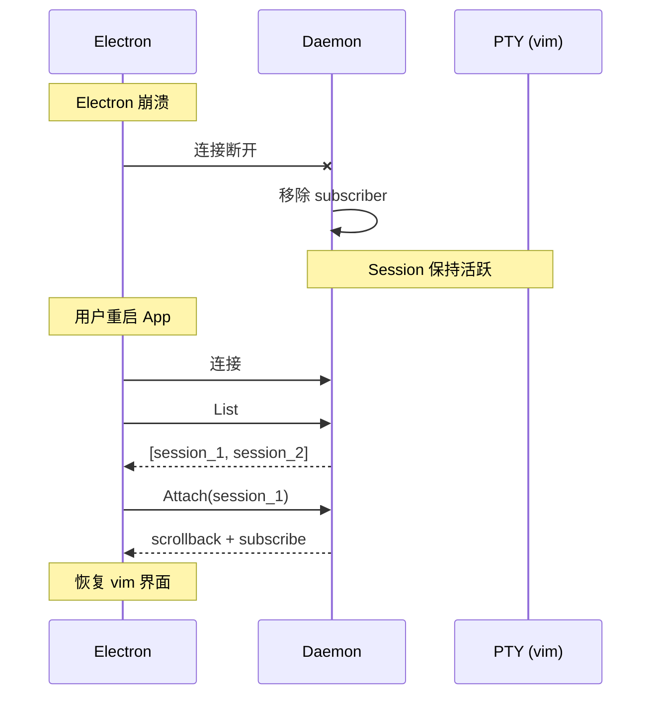
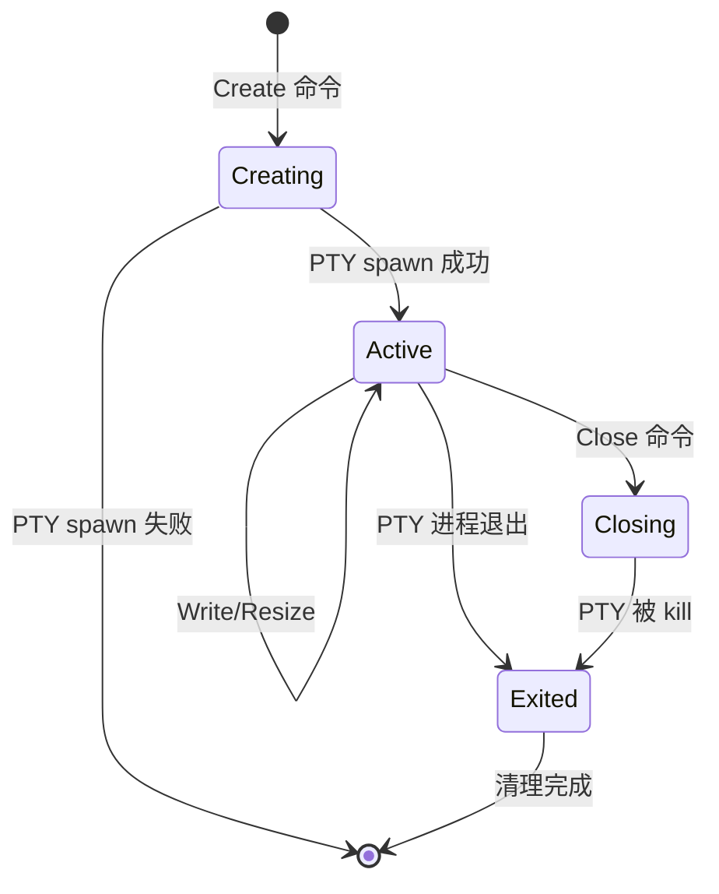

# Rust PTY Daemon for Session Persistence

## Enhancement Summary

**Deepened on:** 2026-02-05
**Research agents used:**

- best-practices-researcher (Rust async PTY patterns)
- security-sentinel (Unix socket security, input validation, resource exhaustion)
- performance-oracle (ring buffer, batching, zero-copy I/O)

### Key Improvements

1. **Production-ready code patterns** for pty-process + tokio, signal handling, Unix socket server
2. **Comprehensive security hardening** including symlink attack prevention, peer credential verification, input validation with schema
3. **Performance-optimized data structures** with line-based ring buffer, dual-threshold batching (16ms/200KB), zero-copy I/O patterns
4. **Binary protocol design** for hot paths achieving ~5x JSON speedup

### New Considerations Discovered

- Use `O_NOFOLLOW` and file descriptor operations to prevent TOCTOU races
- Verify peer credentials (`SO_PEERCRED`) on every connection
- Binary protocol for output streaming, JSON for control messages
- Consider `daemonize` crate for cross-platform daemon creation
- Implement graceful shutdown with `CancellationToken` pattern

---

## Overview

构建一个独立的 Rust PTY daemon 进程，作为 Electron 应用的 PTY 持久化层。当 Electron 崩溃或重启时，PTY sessions 保持活跃，用户可以恢复交互式进程（如 vim、htop）。

**核心价值：**

- Electron 崩溃 → PTY 不丢失 → 恢复 vim 编辑状态
- App 重启 → 重新 attach → 继续工作
- Tab 切换 → 原始字节透传 → 无转换损耗

## Problem Statement / Motivation

### 当前问题

```
Electron Main Process
├─ node-pty (PTY 1)
├─ node-pty (PTY 2)
└─ node-pty (PTY 3)

Electron 崩溃 → 所有 PTY 死亡 → vim/htop 状态丢失
```

### 目标架构

```
┌─────────────────────┐          ┌─────────────────────┐
│  Electron           │          │  Rust PTY Daemon    │
│  (可崩溃/重启)       │ ←──────→ │  (独立进程，常驻)    │
│                     │  Socket  │                     │
└─────────────────────┘          │  PTY 1, 2, 3...     │
                                 │  (始终存活)          │
                                 └─────────────────────┘
```

### 为什么用 Rust

| 方案            | 优点                     | 缺点             |
| --------------- | ------------------------ | ---------------- |
| **Rust daemon** | 高性能、低内存、类型安全 | 开发成本         |
| Node.js daemon  | 熟悉、快速开发           | 内存占用高、GC   |
| 封装 abduco     | 零开发                   | C 依赖、灵活性低 |
| Bun daemon      | 原生 PTY、简单           | 不支持 Windows   |

选择 Rust 是因为：

1. PTY daemon 需要长期运行，低内存占用重要
2. 原始字节处理性能关键
3. 类型安全减少运行时错误
4. 未来可编译为 NAPI addon

## Proposed Solution

### 架构设计

```
┌─────────────────────────────────────────────────────────────────┐
│  Rust PTY Daemon (packages/pty-daemon)                          │
│                                                                  │
│  ┌────────────────────────────────────────────────────────────┐ │
│  │  SessionManager                                             │ │
│  │  HashMap<SessionId, Session>                                │ │
│  │                                                             │ │
│  │  Session {                                                  │ │
│  │    id: Uuid,                                                │ │
│  │    pty: Pty (pty-process crate),                           │ │
│  │    scrollback: VecDeque<u8>,  // 环形缓冲区                 │ │
│  │    subscribers: Vec<ClientId>,                              │ │
│  │    cwd: PathBuf,                                            │ │
│  │    created_at: Instant,                                     │ │
│  │  }                                                          │ │
│  └────────────────────────────────────────────────────────────┘ │
│                              │                                   │
│                 Unix Socket (/tmp/vibest-pty.sock)              │
│                              │                                   │
│  ┌────────────────────────────────────────────────────────────┐ │
│  │  Protocol Handler (JSON-RPC style)                         │ │
│  │                                                             │ │
│  │  Commands:                                                  │ │
│  │  - create { cwd, shell, cols, rows } → session_id          │ │
│  │  - attach { session_id } → scrollback + subscribe          │ │
│  │  - detach { session_id }                                   │ │
│  │  - write { session_id, data }                              │ │
│  │  - resize { session_id, cols, rows }                       │ │
│  │  - close { session_id }                                    │ │
│  │  - list → [session_info]                                   │ │
│  │  - snapshot { session_id } → { scrollback, cwd }           │ │
│  │                                                             │ │
│  │  Events (Server → Client):                                 │ │
│  │  - output { session_id, data }                             │ │
│  │  - exit { session_id, code }                               │ │
│  │  - error { message }                                       │ │
│  └────────────────────────────────────────────────────────────┘ │
└─────────────────────────────────────────────────────────────────┘
```

### 消息协议

```rust
// 请求格式 (Client → Daemon)
#[derive(Serialize, Deserialize)]
#[serde(tag = "type")]
enum Request {
    Create { cwd: String, shell: Option<String>, cols: u16, rows: u16 },
    Attach { session_id: String },
    Detach { session_id: String },
    Write { session_id: String, data: String },  // base64 encoded
    Resize { session_id: String, cols: u16, rows: u16 },
    Close { session_id: String },
    List,
    Snapshot { session_id: String },
}

// 响应格式 (Daemon → Client)
#[derive(Serialize, Deserialize)]
#[serde(tag = "type")]
enum Response {
    Created { session_id: String },
    Attached { session_id: String, scrollback: String },  // base64 encoded
    Detached { session_id: String },
    Closed { session_id: String },
    Sessions { sessions: Vec<SessionInfo> },
    Snapshot { session_id: String, scrollback: String, cwd: String },
    Error { message: String },
}

// 事件格式 (Daemon → Client, 推送)
#[derive(Serialize, Deserialize)]
#[serde(tag = "type")]
enum Event {
    Output { session_id: String, data: String },  // base64 encoded
    Exit { session_id: String, code: i32 },
}
```

### 数据流

```
Write Path (Client → PTY):
  Client.write("ls\n")
    → Unix Socket
    → Daemon.handle_write()
    → session.pty.write()
    → PTY master fd
    → Shell process

Read Path (PTY → Client):
  Shell output
    → PTY master fd
    → tokio::select! { pty.read() }
    → session.scrollback.push()
    → broadcast to subscribers
    → Unix Socket
    → Client.onOutput()
```

### 持久化策略

```
内存中:
  - scrollback: VecDeque<u8>, max 10MB per session
  - 环形缓冲区，超过限制自动丢弃旧数据

磁盘持久化 (可选，App 重启恢复):
  ~/.config/vibest/pty-daemon/
  ├── sessions.json           # Session 元数据
  └── scrollback/
      ├── {session_id}.bin    # 原始 scrollback 数据
      └── ...

  Session 元数据:
  {
    "sessions": [
      {
        "id": "uuid",
        "cwd": "/path/to/dir",
        "shell": "bash",
        "cols": 80,
        "rows": 24,
        "created_at": "2026-02-05T12:00:00Z"
      }
    ]
  }
```

## Technical Considerations

### Rust Crates

```toml
[dependencies]
# Async runtime
tokio = { version = "1", features = ["full", "signal"] }
tokio-util = { version = "0.7", features = ["codec", "sync"] }

# PTY handling
pty-process = "0.5"           # Async PTY with tokio support

# Unix system calls
nix = { version = "0.29", features = ["process", "signal", "pty", "socket", "fs", "user"] }

# Daemonization
daemonize = "0.5"             # Cross-platform daemon creation
fork = "0.2"                  # Alternative for macOS

# Zero-copy buffers
bytes = "1"                   # Reference-counted byte slices

# Serialization
serde = { version = "1", features = ["derive"] }
serde_json = "1"
validator = { version = "0.16", features = ["derive"] }  # Input validation

# Identity
uuid = { version = "1", features = ["v4", "serde"] }

# Error handling
thiserror = "1"

# Logging
tracing = "0.1"
tracing-subscriber = { version = "0.3", features = ["env-filter"] }
tracing-appender = "0.2"      # Log rotation

# CLI
clap = { version = "4", features = ["derive"] }

# Utilities
base64 = "0.22"
directories = "5"
crossbeam-queue = "0.3"       # Lock-free buffer pool

# Security (optional, recommended)
zeroize = { version = "1.7", features = ["derive"] }  # Memory cleanup
aes-gcm = "0.10"              # Scrollback encryption

# Linux-specific
[target.'cfg(target_os = "linux")'.dependencies]
caps = "0.5"                  # Capability checking
```

### Research Insights: Crate Selection

**Best Practices:**

- `pty-process 0.5+` has native tokio support with `AsyncRead`/`AsyncWrite` on PTY
- `bytes::Bytes` enables zero-copy data sharing between tasks
- `tokio-util::sync::CancellationToken` is the recommended pattern for graceful shutdown
- `validator` crate provides schema validation integrated with serde

**Performance Considerations:**

- Prefer `nix` over raw `libc` for safer syscall wrappers
- `crossbeam-queue::ArrayQueue` is lock-free and ideal for buffer pooling
- `tracing-appender` provides non-blocking async log writes

### 性能考量

1. **内存**
   - 目标: < 5MB 基础 + 每 session 10MB scrollback
   - 10 个 session ≈ 105MB
   - 环形缓冲区自动回收

2. **延迟**
   - Unix Socket 本地通信: < 1ms
   - PTY I/O batching: 16ms (可配置)

3. **并发**
   - tokio 异步运行时
   - 每 session 独立 task
   - 无锁设计: channel 通信

### Research Insights: Performance Optimization

**Ring Buffer for Scrollback:**

```rust
use bytes::Bytes;
use std::collections::VecDeque;

/// Line-based ring buffer with pre-computed index for O(1) seek
pub struct ScrollbackBuffer {
    lines: VecDeque<Bytes>,       // Reference-counted, zero-copy
    max_lines: usize,
    total_bytes: usize,
    max_bytes: usize,
    offset_index: Vec<(usize, usize)>,  // Every 100 lines for fast attach
}

impl ScrollbackBuffer {
    /// Push line with automatic eviction
    pub fn push_line(&mut self, line: Bytes) {
        while self.lines.len() >= self.max_lines
            || self.total_bytes + line.len() > self.max_bytes {
            if let Some(old) = self.lines.pop_front() {
                self.total_bytes -= old.len();
            }
        }
        self.total_bytes += line.len();
        self.lines.push_back(line);
    }

    /// Zero-copy range extraction for attach (< 50ms target)
    pub fn get_range_contiguous(&self, start: usize, end: usize) -> Bytes {
        use bytes::BytesMut;
        let total: usize = self.lines.iter()
            .skip(start).take(end - start)
            .map(|l| l.len() + 1).sum();
        let mut buf = BytesMut::with_capacity(total);
        for line in self.lines.iter().skip(start).take(end - start) {
            buf.extend_from_slice(line);
            buf.extend_from_slice(b"\n");
        }
        buf.freeze()
    }
}
```

**Dual-Threshold Batching (16ms + 200KB):**

```rust
pub struct OutputBatcher {
    buffer: BytesMut,
    batch_start: Option<Instant>,
    size_threshold: usize,        // 200KB
    time_threshold: Duration,     // 16ms (~60fps)
}

impl OutputBatcher {
    pub async fn push(&mut self, data: &[u8]) {
        if self.batch_start.is_none() {
            self.batch_start = Some(Instant::now());
        }
        self.buffer.extend_from_slice(data);

        // Immediate flush if size exceeded
        if self.buffer.len() >= self.size_threshold {
            self.flush().await;
        }
    }

    pub async fn maybe_flush(&mut self) -> bool {
        if let Some(start) = self.batch_start {
            if start.elapsed() >= self.time_threshold {
                self.flush().await;
                return true;
            }
        }
        false
    }
}
```

**Binary Protocol for Hot Paths:**

```rust
/// Binary: 9 bytes header vs JSON: ~50 bytes
/// Achieves ~5x faster encoding, ~10x smaller for terminal output
#[inline]
pub fn encode_output(session_id: u32, data: &Bytes) -> Bytes {
    let mut buf = BytesMut::with_capacity(9 + data.len());
    buf.put_u32((5 + data.len()) as u32);  // length prefix
    buf.put_u8(0x83);                       // MessageType::Output
    buf.put_u32(session_id);
    buf.extend_from_slice(data);
    buf.freeze()
}
```

**Performance Budget Analysis:**
| Component | Memory |
|-----------|--------|
| Base daemon | ~3MB |
| Per-session overhead | ~1MB |
| Scrollback per session | 10MB |
| 20 sessions total | ~223MB |

### 安全考量

1. **Socket 权限**
   - 路径: `/tmp/vibest-pty-{uid}.sock`
   - 权限: 0600 (仅用户可访问)

2. **Session 隔离**
   - 每个 session 独立 PTY
   - 无共享状态

### Research Insights: Security Hardening

**Socket Security - Symlink Attack Prevention:**

```rust
use nix::fcntl::{OFlag};
use nix::sys::stat::Mode;
use nix::unistd::{getuid, Uid};

fn create_secure_socket_dir() -> Result<PathBuf, SecurityError> {
    let uid = getuid();
    let dir_path = PathBuf::from(format!("/tmp/vibest-pty-{}", uid));

    if dir_path.exists() || dir_path.symlink_metadata().is_ok() {
        let metadata = fs::symlink_metadata(&dir_path)?;
        // CRITICAL: Detect symlink before following
        if metadata.file_type().is_symlink() {
            return Err(SecurityError::SymlinkAttackDetected);
        }
        // Verify ownership
        let stat = nix::sys::stat::stat(&dir_path)?;
        if Uid::from_raw(stat.st_uid) != uid {
            return Err(SecurityError::OwnershipMismatch);
        }
        fs::remove_dir_all(&dir_path)?;
    }

    fs::create_dir(&dir_path)?;
    fs::set_permissions(&dir_path, Permissions::from_mode(0o700))?;
    Ok(dir_path)
}
```

**Peer Credential Verification:**

```rust
use nix::sys::socket::{getsockopt, sockopt::PeerCredentials};

fn verify_peer_credentials(stream: &UnixStream) -> Result<(), SecurityError> {
    let cred = getsockopt(stream.as_raw_fd(), PeerCredentials)?;
    let my_uid = getuid();

    if Uid::from_raw(cred.uid()) != my_uid {
        return Err(SecurityError::UnauthorizedUser);
    }
    Ok(())
}
```

**Input Validation with Schema:**

```rust
use validator::{Validate, ValidationError};

#[derive(Debug, Deserialize, Validate)]
pub struct CreateCommand {
    #[validate(length(min = 1, max = 64), custom = "validate_session_id")]
    pub session_id: String,

    #[validate(length(max = 256))]
    pub shell: Option<String>,

    #[validate(range(min = 1, max = 500))]
    pub cols: Option<u16>,

    #[validate(range(min = 1, max = 500))]
    pub rows: Option<u16>,
}

fn validate_session_id(id: &str) -> Result<(), ValidationError> {
    if !id.chars().all(|c| c.is_alphanumeric() || c == '-' || c == '_') {
        return Err(ValidationError::new("invalid_session_id"));
    }
    Ok(())
}
```

**Resource Exhaustion Protection:**

```rust
pub struct ResourceLimits {
    max_sessions: usize,           // 100
    max_connections: usize,        // 50
    max_scrollback_per_session: usize,  // 10MB
    max_scrollback_total: usize,   // 500MB
    max_message_size: usize,       // 64KB
}

pub struct ConnectionThrottler {
    max_per_second: usize,         // 20
    recent_connections: VecDeque<Instant>,
}
```

**Shell Allowlist:**

```rust
const ALLOWED_SHELLS: &[&str] = &[
    "/bin/bash", "/bin/sh", "/bin/zsh",
    "/usr/bin/bash", "/usr/bin/zsh",
    "/usr/local/bin/bash", "/usr/local/bin/zsh",
];

fn validate_shell(shell: &str) -> Result<&'static str, SecurityError> {
    let canonical = std::fs::canonicalize(shell)?;
    for &allowed in ALLOWED_SHELLS {
        if canonical.to_str() == Some(allowed) {
            return Ok(allowed);
        }
    }
    Err(SecurityError::ShellNotAllowed(shell.to_string()))
}
```

**Security Checklist:**
| Category | Risk | Mitigation | Status |
|----------|------|------------|--------|
| Socket | Symlink attacks | O_NOFOLLOW, ownership check | Required |
| Socket | TOCTOU races | File descriptor operations | Required |
| Socket | Unauthorized access | SO_PEERCRED verification | Required |
| Input | Oversized messages | 64KB limit | Required |
| Input | Malformed JSON | validator crate | Required |
| Resources | Session flooding | Max 100 sessions | Required |
| Resources | Connection flood | 20/sec rate limit | Required |
| Privilege | Running as root | Refuse startup | Required |
| Data | Scrollback on disk | AES-256-GCM encryption | Recommended |

### 错误处理

1. **PTY 进程退出**: 广播 `Exit` 事件，清理 session
2. **Client 断开**: 从 subscribers 移除，保留 session
3. **Daemon 崩溃**: 可选磁盘持久化恢复 scrollback（PTY 进程仍会丢失）

## Acceptance Criteria

### 核心功能

- [ ] **Session 创建**: `create` 命令创建 PTY session
- [ ] **Attach/Detach**: 支持多客户端 attach 同一 session
- [ ] **数据透传**: 原始字节透传，无终端模拟转换
- [ ] **Scrollback**: 保存最近 10MB 输出
- [ ] **Resize**: 动态调整 PTY 大小
- [ ] **List**: 列出所有活跃 session
- [ ] **Close**: 显式关闭 session

### 持久化

- [ ] **崩溃恢复**: Electron 崩溃后 PTY 保持活跃
- [ ] **重启恢复**: App 重启后可 re-attach（如果 daemon 仍运行）
- [ ] **磁盘持久化**: (可选) scrollback 持久化到磁盘

### 集成

- [ ] **TypeScript 客户端**: `packages/pty-daemon-client` 封装
- [ ] **Electron 集成**: 替换 `TerminalManager` 中的 node-pty
- [ ] **Daemon 生命周期**: App 启动时自动启动 daemon

### 测试

- [ ] **单元测试**: Session 管理、消息解析
- [ ] **集成测试**: 完整 attach/detach 流程
- [ ] **压力测试**: 20 个 concurrent sessions

## Implementation Phases

### Phase 1: Core Daemon (MVP)

**目标**: 基础 PTY daemon，支持 create/attach/write/close

**文件结构**:

```
packages/pty-daemon/
├── Cargo.toml
├── src/
│   ├── main.rs           # 入口，daemon 启动
│   ├── server.rs         # Unix Socket 服务器
│   ├── session.rs        # Session 管理
│   ├── protocol.rs       # 消息协议定义
│   ├── pty.rs            # PTY 包装
│   ├── scrollback.rs     # 环形缓冲区
│   ├── batcher.rs        # 输出批处理
│   ├── security.rs       # 安全验证
│   └── error.rs          # 错误类型
└── README.md
```

**任务**:

1. 项目初始化 + Cargo.toml
2. 消息协议定义 (protocol.rs) - 包含 binary 和 JSON 两种格式
3. PTY 包装 (pty.rs) - 使用 pty-process 0.5+
4. Scrollback 实现 (scrollback.rs) - 带索引的环形缓冲区
5. 输出批处理 (batcher.rs) - 16ms/200KB 双阈值
6. 安全模块 (security.rs) - 目录创建、peer 验证、输入校验
7. Session 管理 (session.rs)
8. Unix Socket 服务器 (server.rs) - 带 framing
9. 入口 + daemon 化 (main.rs) - 使用 daemonize crate

### Research Insights: PTY I/O Pattern

```rust
use pty_process::{Command, Pty, Size};
use tokio::io::{AsyncReadExt, AsyncWriteExt};

pub struct PtySession {
    pty: Pty,
    child: tokio::process::Child,
}

impl PtySession {
    pub async fn spawn(shell: &str, rows: u16, cols: u16) -> io::Result<Self> {
        let (pty, pts) = pty_process::open()?;
        pty.resize(Size::new(rows, cols))?;

        let mut cmd = Command::new(shell);
        cmd.args(["--login"]);
        let child = cmd.spawn(pts)?;

        Ok(Self { pty, child })
    }
}

/// Bidirectional PTY bridge with cancellation
pub async fn pty_bridge(
    mut pty_io: PtyIO,
    mut input_rx: mpsc::UnboundedReceiver<Bytes>,
    output_tx: mpsc::UnboundedSender<Bytes>,
    cancel: CancellationToken,
) -> io::Result<()> {
    loop {
        tokio::select! {
            biased; // Prioritize cancellation

            _ = cancel.cancelled() => break,

            Some(data) = input_rx.recv() => {
                pty_io.write(&data).await?;
            }

            result = pty_io.read() => {
                match result? {
                    Some(data) => {
                        if output_tx.send(data).is_err() { break; }
                    }
                    None => break, // EOF
                }
            }
        }
    }
    Ok(())
}
```

### Research Insights: Unix Socket Server Pattern

```rust
use tokio::net::{UnixListener, UnixStream};

pub struct UnixSocketServer {
    listener: UnixListener,
    socket_path: PathBuf,
}

impl UnixSocketServer {
    pub fn bind<P: AsRef<Path>>(path: P) -> io::Result<Self> {
        let socket_path = path.as_ref().to_path_buf();

        // Remove stale socket
        if socket_path.exists() {
            fs::remove_file(&socket_path)?;
        }

        let listener = UnixListener::bind(&socket_path)?;

        // Set socket permissions (owner-only)
        #[cfg(unix)]
        fs::set_permissions(&socket_path, Permissions::from_mode(0o600))?;

        Ok(Self { listener, socket_path })
    }
}

impl Drop for UnixSocketServer {
    fn drop(&mut self) {
        let _ = fs::remove_file(&self.socket_path);
    }
}

/// Length-prefixed message framing
pub struct FramedConnection {
    stream: UnixStream,
    read_buf: BytesMut,
}

impl FramedConnection {
    const MAX_FRAME_SIZE: usize = 16 * 1024 * 1024; // 16MB

    pub async fn read_frame(&mut self) -> io::Result<Option<Bytes>> {
        // Read 4-byte length prefix
        if self.read_buf.len() < 4 {
            self.stream.read_buf(&mut self.read_buf).await?;
        }

        let len = u32::from_be_bytes([
            self.read_buf[0], self.read_buf[1],
            self.read_buf[2], self.read_buf[3],
        ]) as usize;

        if len > Self::MAX_FRAME_SIZE {
            return Err(io::Error::new(io::ErrorKind::InvalidData, "frame too large"));
        }

        // Read until we have complete frame
        while self.read_buf.len() < 4 + len {
            self.stream.read_buf(&mut self.read_buf).await?;
        }

        self.read_buf.advance(4);
        Ok(Some(self.read_buf.split_to(len).freeze()))
    }
}
```

### Research Insights: Daemonization

```rust
use daemonize::Daemonize;

pub fn daemonize_process(config: &DaemonConfig) -> Result<(), Box<dyn std::error::Error>> {
    let stdout = File::create(&config.log_dir.join("stdout.log"))?;
    let stderr = File::create(&config.log_dir.join("stderr.log"))?;

    let daemonize = Daemonize::new()
        .pid_file(&config.pid_file)
        .chown_pid_file(true)
        .working_directory(&config.working_dir)
        .umask(0o027)  // rwxr-x---
        .stdout(stdout)
        .stderr(stderr);

    daemonize.start()?;
    Ok(())
}
```

### Phase 2: TypeScript Client

**目标**: Node.js 客户端库，用于 Electron 集成

**文件结构**:

```
packages/pty-daemon-client/
├── package.json
├── tsconfig.json
├── src/
│   ├── index.ts          # 导出
│   ├── client.ts         # PtyDaemonClient 类
│   ├── protocol.ts       # TypeScript 类型定义
│   └── utils.ts          # 工具函数
└── README.md
```

**任务**:

1. 项目初始化
2. Unix Socket 连接
3. 消息编解码
4. 事件发射器
5. 类型定义

### Phase 3: Electron Integration

**目标**: 替换现有 node-pty 实现

**修改文件**:

- `apps/desktop/src/main/terminal/terminal-manager.ts`
- `apps/desktop/src/main/app.ts`
- `apps/desktop/package.json`

**任务**:

1. 引入 pty-daemon-client
2. 重构 TerminalManager
3. Daemon 启动逻辑
4. 保留 HeadlessTerminal 用于前端快照

### Phase 4: Persistence & Polish

**目标**: 磁盘持久化 + 生产就绪

**任务**:

1. Scrollback 磁盘持久化
2. Session 元数据持久化
3. Daemon 崩溃恢复
4. 日志和监控
5. 文档

## Success Metrics

| 指标        | 目标                      |
| ----------- | ------------------------- |
| 内存占用    | < 5MB 基础 + 10MB/session |
| 启动时间    | < 100ms                   |
| Attach 延迟 | < 50ms                    |
| 数据吞吐    | > 10MB/s                  |
| 崩溃恢复    | 100% session 保留         |

## Critical Design Decisions

### Decision 1: HeadlessTerminal 去留

**选择：移除 HeadlessTerminal，由 Daemon 完全接管状态管理**

原因：

- Daemon 已提供 scrollback，无需重复
- 减少内存占用和代码复杂度
- 避免状态不一致

保留的部分：

- 终端模式追踪逻辑可移植到 Daemon（可选）
- 或由前端 xterm.js 自行处理

### Decision 2: Session 元数据存储

**选择：Daemon 存储完整元数据，包括 worktreeId**

```rust
struct SessionMetadata {
    id: Uuid,
    worktree_id: String,  // 来自创建请求
    cwd: PathBuf,
    shell: String,
    cols: u16,
    rows: u16,
    created_at: DateTime<Utc>,
}
```

这样 App 重启后能恢复完整的 session-worktree 关联。

### Decision 3: 批处理策略

**选择：Daemon 端批处理，类似现有 DataBatcher**

```rust
const BATCH_DURATION_MS: u64 = 16;
const BATCH_MAX_SIZE: usize = 200 * 1024;

// 使用 tokio 定时器批处理输出
```

## Edge Cases & Race Conditions

### 快速 Tab 切换 (Rapid Attach/Detach)

```
问题：用户快速切换 Tab 时可能重复发送 attach
解决：
  - Attach 请求带 request_id
  - Client 端取消前一个 pending attach
  - Server 端 attach 幂等（重复 attach 只更新订阅）
```

### 多客户端并发写入

```
问题：两个窗口同时输入可能导致输入交错
解决：
  - FIFO 顺序，先到先处理
  - 每条 Write 消息原子写入 PTY
  - 不做额外锁定（shell 本身处理）
```

### 快照一致性

```
问题：Snapshot 时 PTY 仍在输出
解决：
  - Snapshot 返回当前时刻快照
  - 后续输出正常推送
  - Client 负责合并（先写 snapshot，再处理 events）
```

### Session 关闭时的 In-flight 请求

```
问题：Write 请求发出后 Session 被关闭
解决：
  - Write 返回 Result，关闭后返回 Error
  - Client 忽略已关闭 session 的错误
```

## Daemon Lifecycle Management

### 启动流程

```
Electron 启动
    │
    ├─ 1. 检查 socket 文件存在?
    │     └─ 是 → 尝试连接
    │            └─ 成功 → 使用现有 daemon
    │            └─ 失败 → 清理 stale socket
    │
    ├─ 2. 检查 pid 文件存在?
    │     └─ 是 → 进程存在?
    │            └─ 是 → 等待 socket 可用
    │            └─ 否 → 清理 pid 文件
    │
    └─ 3. 启动新 daemon
          ├─ spawn daemon 进程 (detached)
          ├─ 等待 socket 可用 (最多 5 秒)
          └─ 连接
```

### 文件路径

```
/tmp/vibest-pty-{uid}/
├── vibest-pty.sock    # Unix socket
├── vibest-pty.pid     # PID 文件
└── vibest-pty.log     # 日志文件 (可选)

~/.config/vibest/pty-daemon/
├── sessions.json      # Session 元数据持久化
└── scrollback/        # Scrollback 数据
```

### 信号处理

| 信号    | 行为                                                   |
| ------- | ------------------------------------------------------ |
| SIGTERM | 优雅关闭：通知所有 client，等待 pending 写入，清理资源 |
| SIGINT  | 同 SIGTERM                                             |
| SIGHUP  | 忽略（允许 controlling terminal 关闭）                 |
| SIGCHLD | 处理子进程（PTY）退出                                  |

### Research Insights: Signal Handling Implementation

```rust
use tokio::signal::unix::{signal, SignalKind};
use tokio::sync::broadcast;
use tokio_util::sync::CancellationToken;

pub struct SignalHandler {
    shutdown_tx: broadcast::Sender<ShutdownSignal>,
}

impl SignalHandler {
    pub async fn run(self) -> std::io::Result<()> {
        let mut sigint = signal(SignalKind::interrupt())?;
        let mut sigterm = signal(SignalKind::terminate())?;
        let mut sighup = signal(SignalKind::hangup())?;

        loop {
            let signal = tokio::select! {
                _ = sigint.recv() => ShutdownSignal::Interrupt,
                _ = sigterm.recv() => ShutdownSignal::Terminate,
                _ = sighup.recv() => ShutdownSignal::Hangup,
            };

            let _ = self.shutdown_tx.send(signal);

            if matches!(signal, ShutdownSignal::Interrupt | ShutdownSignal::Terminate) {
                break;
            }
        }
        Ok(())
    }
}

/// SIGCHLD handler for reaping child processes
pub async fn child_reaper(event_tx: mpsc::UnboundedSender<ChildEvent>) {
    let mut sigchld = signal(SignalKind::child()).unwrap();

    loop {
        sigchld.recv().await;
        // Reap all terminated children (non-blocking)
        loop {
            match waitpid(Pid::from_raw(-1), Some(WaitPidFlag::WNOHANG)) {
                Ok(WaitStatus::Exited(pid, code)) => {
                    let _ = event_tx.send(ChildEvent::Exited { pid: pid.as_raw(), code });
                }
                _ => break,
            }
        }
    }
}

/// Graceful shutdown coordinator with timeout
pub struct ShutdownCoordinator {
    cancel_token: CancellationToken,
    task_count: AtomicUsize,
}

impl ShutdownCoordinator {
    pub async fn shutdown(&self, grace_period: Duration) {
        self.cancel_token.cancel();

        let start = Instant::now();
        while self.task_count.load(Ordering::SeqCst) > 0 {
            if start.elapsed() > grace_period {
                tracing::warn!("Shutdown grace period exceeded");
                break;
            }
            tokio::time::sleep(Duration::from_millis(50)).await;
        }
    }
}
```

### Socket 安全

```
路径: /tmp/vibest-pty-{uid}/vibest-pty.sock
目录权限: 0700 (drwx------)
Socket 权限: 0600 (srw-------)

防护:
- 目录按 uid 隔离
- 启动时检查目录所有者
- 拒绝 symlink (O_NOFOLLOW)
```

## Error Response Schema

```rust
#[derive(Serialize, Deserialize)]
struct ErrorResponse {
    r#type: String,  // "Error"
    code: ErrorCode,
    message: String,
    details: Option<serde_json::Value>,
}

#[derive(Serialize, Deserialize)]
enum ErrorCode {
    SessionNotFound,
    SessionClosed,
    CreateFailed,
    InvalidRequest,
    SocketError,
    InternalError,
    MaxSessionsReached,
    InvalidCwd,
}
```

## Connection Retry Strategy

```typescript
// Client 端重试策略
const RETRY_CONFIG = {
  maxRetries: 3,
  baseDelay: 100, // ms
  maxDelay: 2000, // ms
  backoffMultiplier: 2,
};

// 100ms → 200ms → 400ms (max 3 attempts)
```

## Dependencies & Risks

### 依赖

- Rust toolchain (cargo)
- tokio 异步运行时
- pty-process crate
- pnpm workspace 集成

### 风险

| 风险               | 影响 | 缓解                                    |
| ------------------ | ---- | --------------------------------------- |
| Rust 学习曲线      | 中   | 参考 abduco 源码，使用成熟 crates       |
| pty-process 兼容性 | 低   | 该 crate 广泛使用，macOS/Linux 支持良好 |
| Daemon 稳定性      | 高   | 充分测试，日志完善                      |
| 磁盘 I/O 性能      | 低   | 仅写 scrollback，异步 I/O               |
| Socket 残留        | 中   | 启动时检测 stale socket，自动清理       |
| 多实例竞争         | 中   | 使用 flock 确保单例 daemon              |

## References & Research

### Internal References

- 现有终端实现: `apps/desktop/src/main/terminal/terminal-manager.ts`
- HeadlessTerminal: `apps/desktop/src/main/terminal/headless-terminal.ts`
- IPC 模式: `apps/desktop/src/main/ipc/router/terminal.ts`
- 服务模式: `apps/desktop/src/main/app.ts`

### External References

**Official Documentation:**

- [pty-process crate docs](https://docs.rs/pty-process/0.5.3/pty_process) - Async PTY with tokio
- [Tokio signal handling](https://docs.rs/tokio/latest/tokio/signal/index.html)
- [Tokio UnixListener](https://docs.rs/tokio/latest/tokio/net/struct.UnixListener.html)
- [Tokio Graceful Shutdown Guide](https://tokio.rs/tokio/topics/shutdown)
- [Tokio Framing Tutorial](https://tokio.rs/tokio/tutorial/framing)

**Daemonization:**

- [daemonize crate](https://docs.rs/daemonize/latest/daemonize/struct.Daemonize.html)
- [fork crate](https://docs.rs/fork/latest/fork/fn.daemon.html) - macOS compatible
- [Building a Daemon using Rust](https://tuttlem.github.io/2024/11/16/building-a-daemon-using-rust.html)

**Buffer Management:**

- [bytes::BytesMut](https://rustasync.github.io/runtime/bytes/struct.BytesMut.html)
- [Zero-Copy Patterns for Rust](https://medium.com/@FAANG/stop-copying-start-teleporting-bytes-rusts-zero-copy-super-power-for-2025-scale-throughput-a6a88b44d7f4)

**Terminal Multiplexer Examples:**

- [Tab Terminal Multiplexer](https://implaustin.hashnode.dev/how-to-write-a-terminal-multiplexer-with-rust-async-and-actors-part-2)
- [Linux TTY with Async Rust](https://developerlife.com/2024/08/20/tty-linux-async-rust/)

**Architecture References:**

- [tmux 源码](https://github.com/tmux/tmux) - 参考架构
- [abduco 源码](https://github.com/martanne/abduco) - 简化实现参考
- [tokio-graceful-shutdown](https://lib.rs/crates/tokio-graceful-shutdown)

### 相关讨论

- 本次对话中的 tmux 架构分析
- abduco 作为轻量替代方案
- Bun 原生 PTY 作为备选

## Sequence Diagrams

### 启动流程



### 崩溃恢复流程



### Session 状态机



## Appendix: Quick Start Commands

```bash
# 创建 Rust 项目
mkdir -p packages/pty-daemon
cd packages/pty-daemon
cargo init

# 添加依赖
cargo add tokio --features "full,signal"
cargo add tokio-util --features "codec,sync"
cargo add pty-process@0.5
cargo add nix --features "process,signal,pty,socket,fs,user"
cargo add bytes
cargo add serde --features derive
cargo add serde_json
cargo add validator --features derive
cargo add uuid --features "v4,serde"
cargo add thiserror
cargo add tracing tracing-subscriber --features "tracing-subscriber/env-filter"
cargo add tracing-appender
cargo add clap --features derive
cargo add daemonize
cargo add crossbeam-queue

# 构建
cargo build --release

# 运行 daemon (前台模式用于开发)
./target/release/pty-daemon --foreground

# 运行 daemon (后台模式)
./target/release/pty-daemon

# 测试 (使用 socat)
echo '{"type":"List"}' | socat - UNIX-CONNECT:/tmp/vibest-pty-$(id -u)/vibest-pty.sock

# 运行基准测试
cargo bench

# 运行安全检查
cargo audit
cargo clippy -- -D warnings
```

## Appendix: Benchmarking Template

```rust
// benches/scrollback.rs
use criterion::{criterion_group, criterion_main, Criterion, Throughput};

fn benchmark_scrollback(c: &mut Criterion) {
    let mut group = c.benchmark_group("scrollback");
    group.throughput(Throughput::Bytes(1024));

    group.bench_function("push_line", |b| {
        let mut buffer = ScrollbackBuffer::new(100_000, 10_000_000);
        let line = Bytes::from(vec![b'x'; 100]);
        b.iter(|| buffer.push_line(line.clone()));
    });

    group.bench_function("get_range_10k_lines", |b| {
        let mut buffer = ScrollbackBuffer::new(100_000, 10_000_000);
        for _ in 0..10_000 {
            buffer.push_line(Bytes::from(vec![b'x'; 100]));
        }
        b.iter(|| buffer.get_range_contiguous(0, 10_000));
    });

    group.finish();
}

fn benchmark_serialization(c: &mut Criterion) {
    let mut group = c.benchmark_group("serialization");
    let payload = Bytes::from(vec![0u8; 1024]);

    group.throughput(Throughput::Bytes(1024));

    group.bench_function("binary_encode", |b| {
        b.iter(|| BinaryCodec::encode_output(42, &payload));
    });

    group.finish();
}

criterion_group!(benches, benchmark_scrollback, benchmark_serialization);
criterion_main!(benches);
```
